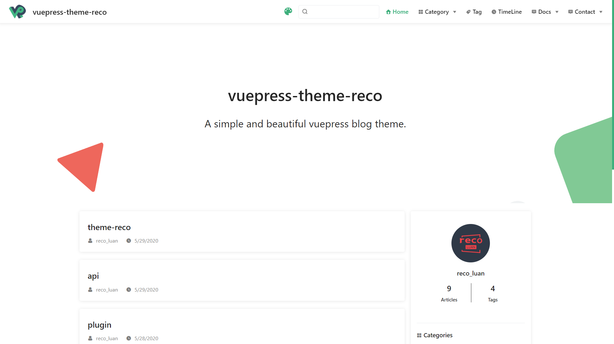

# 如何搭建一个和我一样的博客网站？

## 一、介绍

如果你想搭建一个博客网站，其实是非常简单的，但是需要一定的编程基础，甚至不需要 VUE 的基础，只需要了解 JavaScipt 和 Npm、git 的常用指令即可。

如果你想最快速的部署一个免费的博客网站，推荐看这个视频：[小张 Alan](https://www.bilibili.com/video/BV17Q4y1Y7LF)。我就是根据这个视频的教程来部署的。

我这边分享一下，我是如何建站的。
其实我是最先在 B 站上搜索一些使用 vuepress 博客建站的资料，刚好看到视频下面有一个 B 友发的自己的网站，我觉得值得学习和模仿，这边推荐你们访问： [PengSir](https://www.bookbook.cc/)。

## 二、关于 vuepress 安装和使用

### 1. 下载和安装

视频中推荐的下载示例的地址我这边也给贴上：
vuepress-reco https://github.com/vuepress-reco/vuepress-theme-reco-demo/tree/demo/1.x

下面是本地包管理下载方法

```
npx @vuepress-reco/theme-cli init

# or

npm install @vuepress-reco/theme-cli -g
theme-cli init

# or

yarn global add @vuepress-reco/theme-cli
theme-cli init
```

安装完成后：

1. 执行在终端窗口中输入`npm i` 初始化项目。
2. 在本地预览项目是否能够成功运行。
   `npm run dev`
   
3. 在 github 中创建仓库，我创建的仓库名称是 BLOG
   在本地目录下执行 git 指令，初始化 git
   ```
   git init
   git add .
   git commit -m 'init'
   git remote add origin 你的github仓库地址
   git branch -M main
   git push -u origin main
   ```
4. vercel 是一个国外的免费平台，可以同步到 [vercel](https://vercel.com/)

### 2. 插件的配置

<font color=ff0000>**注意：**</font>插件必须执行指令安装插件后配置，才能生效

1. 分页插件

```
['@vuepress-reco/vuepress-plugin-pagation', {}]
```

2. 画板娘

```
[
  '@vuepress-reco/vuepress-plugin-kan-ban-niang',
  {
    theme: ['shizuku', 'whiteCat', 'haru1', 'haru2', 'haruto', 'koharu', 'izumi', 'miku', 'blackCat', 'z16'],
    clean: false,
    messages: {
      welcome: '欢迎来到我的博客',
      home: '谢谢你的喜欢哦',
      theme: '大家一起努力呀',
      close: '拜拜哦'
    },
    messageStyle: { right: '68px', bottom: '190px' },
    width: 150,
    height: 220
  }
]
```

3. 鼠标特效

```
[
  'cursor-effects',
  {
    size: 2, // size of the particle, default: 2
    shape: ['star'], // shape of the particle, default: 'star'
    zIndex: 999999999 // z-index property of the canvas, default: 999999999
  }
]
```

4. 复制代码

```
[
  'vuepress-plugin-nuggets-style-copy',
  {
    copyText: '复制代码', //vuepress复制粘贴提示插件P 先安装在配置 npm install vuepress-plugin-nuggets-style-copy --save
    tip: {
      content: '复制成功!'
    }
  }
]
```
